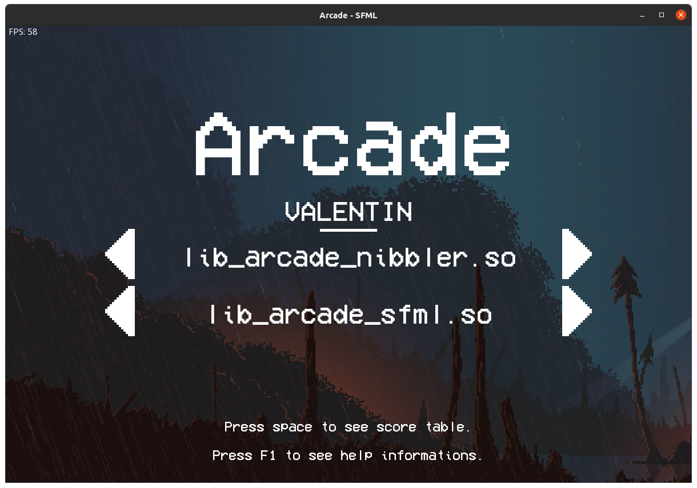
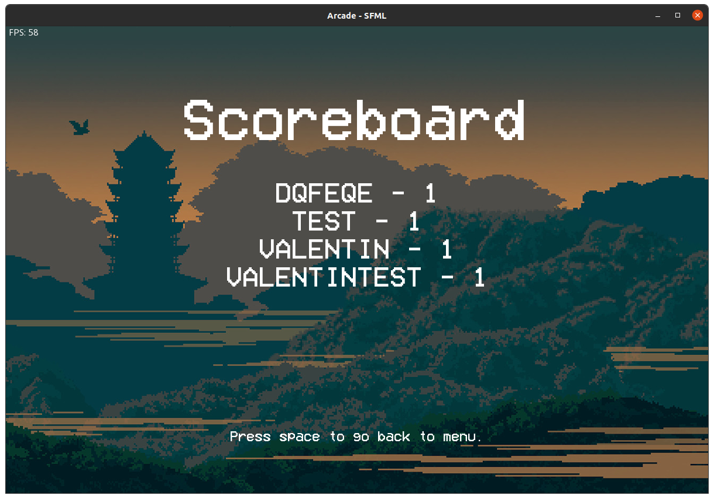
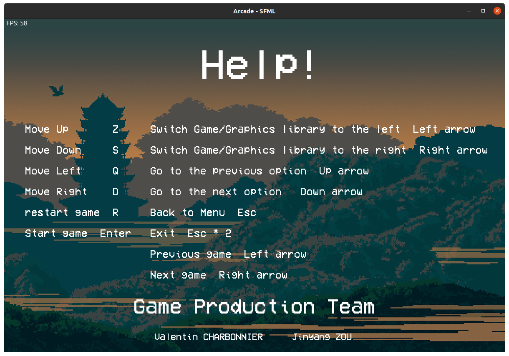
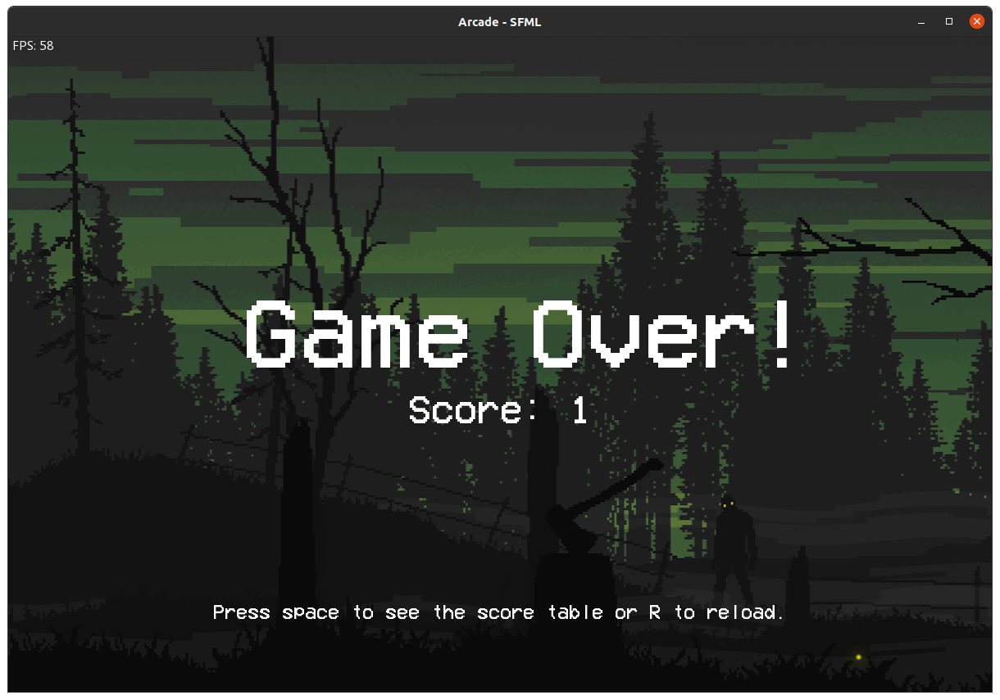
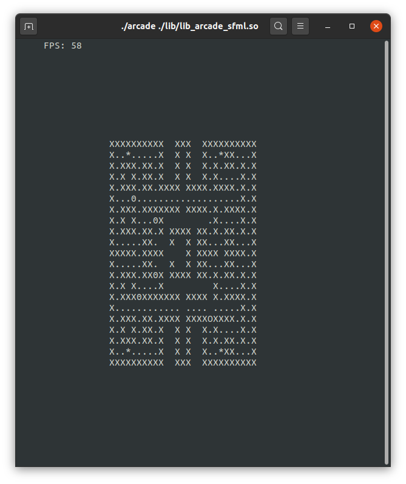
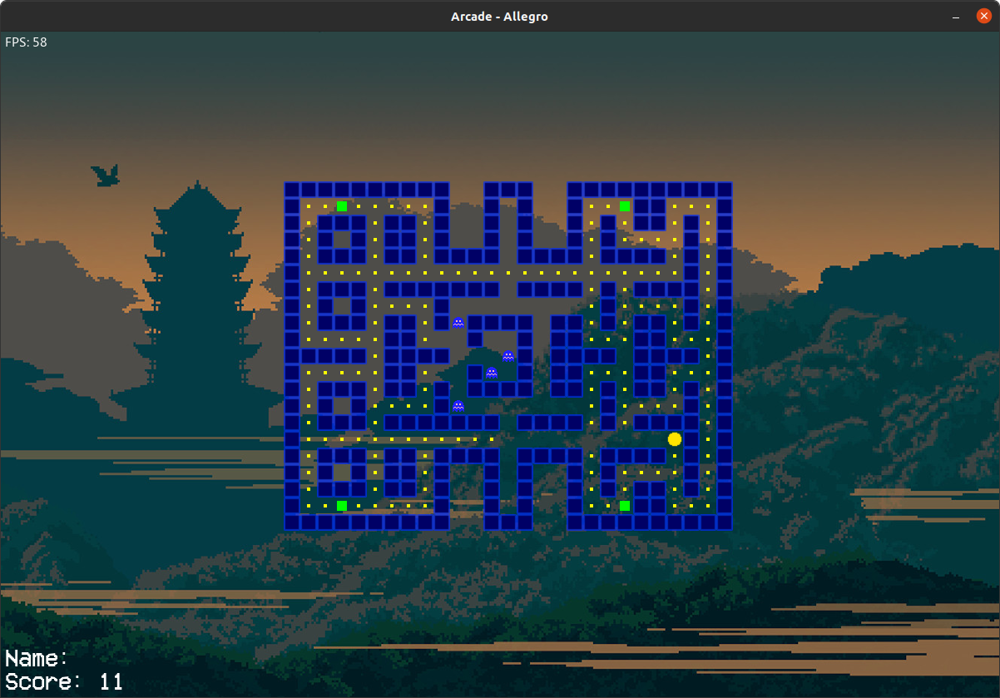

# Documentation OOP_arcade_2019
This is a documentation (written in markdown and generated with pandoc) for the project OOP_arcade_2019. Its purpose is to document the installation steps, usage and architecture of the project to help you implement your own libs and games!

Arcade is a gaming platform: a program that lets the user choose a game to play and keeps a
register of player scores. To be able to deal with the elements of the gaming plateform at run-time,
graphics libraries and games must be implemented as dynamic libraries, loaded at runtime.

---

## Sommaire
[Installation of graphic libraries for example](#installib)

* [SFML](#sfml)

* [Ncurses](#ncurses)

* [Allegro](#allegro)

[Screenshots (example games and libs)](#screen)

[Use](#using)

[Architecture and implementation](#archi)


\newpage
## Installation of graphic libraries <a id="installib"></a>
### SFML <a id="sfml"></a>
#### Ubuntu
```
sudo apt-get install libsfml-dev
```
#### Fedora
```
sudo dnf install libsfml-dev
```
### Ncurses <a id="ncurses"></a>
#### Ubuntu
```
sudo apt-get install libncurses5-dev libncursesw5-dev
```
#### Fedora
```
sudo dnf install ncurses-devel
```
### Allegro <a id="allegro"></a>
#### Ubuntu
```
sudo apt-get install liballegro5-dev
```

\newpage

{ width=97% .center }

{ width=97% .center }

{ width=97% .center }

{ width=97% .center }

\newpage
## Use <a id="using"></a>
The arcade launches from a terminal as shown below:

```
./arcade ./lib/lib_arcade_opengl.so
```
The games should be placed in the `./games` directory, the libraries in the `./lib` directory.

\newpage
#### Keys

Specific keys are set for the Arcade but all the keyboard can be used for your games. This are not editable (except by changing the Arcade source code).

##### Switch

|  Key | Action  |
|---|---|
| Left Arrow | Previous game | 
| Right Arrow |  Next game | 
|  Up Arrow | Previous lib  |
|  Down Arrow | Next lib  |


##### Special

|  Key | Action  |
|---|---|
| R | Reload game | 
| Escape | Back |
| Space | Next | 

\newpage
## Architecture and implementation <a id="archi"></a>

Due to its architecture, the Arcade project is able to load different graphics and games lib at run time.

To implement your own graphic library you need to follow this interface (some examples are provided in /lib/ and /games/ folder) :

```C++
class IGraphic
{
    public:
        virtual ~IGraphic() = default;
        virtual void openWindow(std::size_t height, std::size_t width,
        const std::string &name) = 0;
        virtual void closeWindow() = 0;
        virtual void loadGameObject(int tag, const std::string &sprite_path,
        std::pair<int, int> pos) = 0;
        virtual void displayGameObject(int tag) = 0;
        virtual void setGameObject(int tag, std::pair<int, int> pos, const
        std::string &sprite_path = "") = 0;
        virtual void removeGameObject(int tag) = 0;
        virtual void removeGameObjects() = 0;
        virtual void displayText(const std::string &text, const std::string
        &font, std::pair<int, int>  pos, size_t size = 1) = 0;
        virtual bool isKeyPressed(Key key) = 0;
        virtual bool isWindowOpen() = 0;
        virtual void clearWindow() = 0;
        virtual void displayWindow() = 0;
};
```
All of these function must be implemented according to your graphic library. To implement your own games you need to follow this interface :

```C++
class IGame
{
   public:
       virtual ~IGame() = default;
       virtual void start(std::shared_ptr<IGraphic>) = 0;
       virtual void resume() = 0;
       virtual int getScore() const = 0;
       bool _gameover;
};
```

Same as the graphic libary, all of these functions must be implemented to use your game in this Arcade platform. Your dynamic 
libs must also implement an entry point defined as below :

```C++
extern "C" std::shared_ptr<IGame> entry()
{
    return std::make_shared<YourGame>();
}
```

And for a graphic library implementation:

```C++
extern "C" std::shared_ptr<IGraphic> entry()
{
    return std::make_shared<YourGraphiclib>();
}
```

Example of the same Pacman game used with ncurses and Allegro:

{ width=50% .center }

{ width=97% .center }